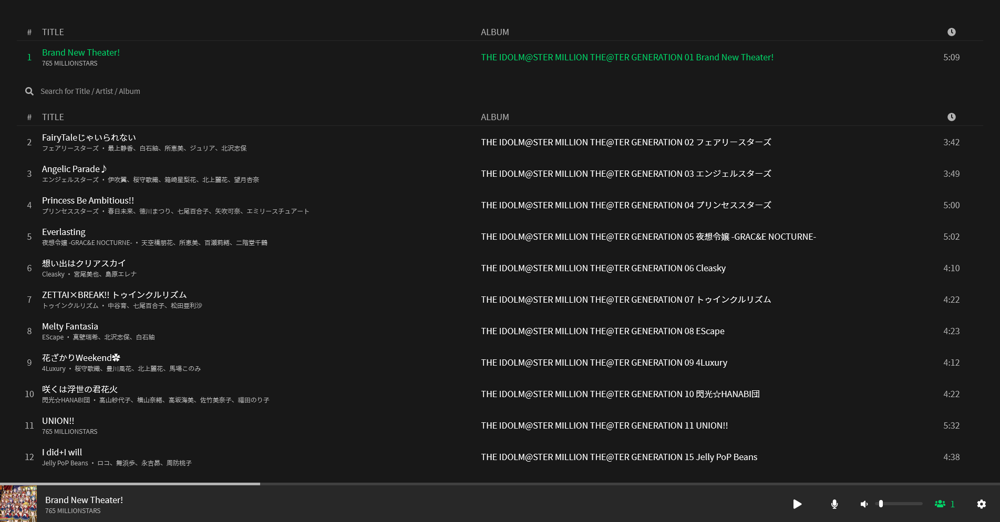
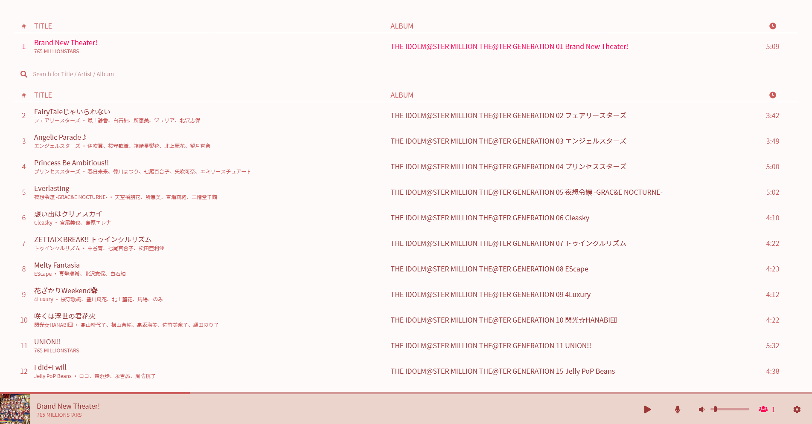

<!-- PROJECT LOGO -->
<br />
<p align="center">
  <a href="https://github.com/hw4n/melody">
    
  </a>

  <h3 align="center">Melody</h3>

  <p align="center">
    Radio-ish music streaming on a web
  </p>
</p>

<!-- TABLE OF CONTENTS -->
<details open="open">
  <summary>Table of Contents</summary>
  <ol>
    <li>
      <a href="#about-the-project">About The Project</a>
      <ul>
        <li><a href="#built-with">Built With</a></li>
        <li><a href="#key-features">Key Features</a></li>
      </ul>
    </li>
    <li>
      <a href="#getting-started">Getting Started</a>
      <ul>
        <li><a href="#starting-development-environment">Starting development environment</a></li>
        <li><a href="#distributing">Distributing</a></li>
      </ul>
    </li>
    <li><a href="#contributing">Contributing</a></li>
    <li><a href="#license">License</a></li>
    <li><a href="#contact">Contact</a></li>
  </ol>
</details>

<!-- ABOUT THE PROJECT -->
## About The Project

dark mode (default) | light mode
:-------------------------:|:-------------------------:
  |  

Spotify is cool and I love it, but how do you enjoy any mp3 file you have with your friends? What if they don't have music that you wanted? This project's main objective is to be able to enjoy mp3 file with others, in the same time.

### Built With

* [ReactJS](https://reactjs.org)
* [Socket.io](https://socket.io)

### Key Features

Simply put, it's an endless radio station made of your mp3 files.

#### Backend Features

* Radio station - Doesn't stop even if noone's listening.
* Enqueuing music by request
* Synchronized music position
* Extracting cover image and metadata from mp3 file
  * [Romaji converting music title and artist for Japanese](https://github.com/hexenq/kuroshiro)
* Saving and comparing metadata on a mongoDB database
* Get/Update lyrics from the database
* Console commands
  * Force skipping music
  * Reloading music without restarting the server

#### Frontend Features

* Enqueuing music
* Synchronized music position
* Responsive design for both PC and mobile
* Mediasession support with cover image and metadata
* Reading and editing lyrics with HTML
* Features for searching music
  * Sorting title to ascending/descending order
  * Searching through music title/artist/album
  * Searching through romaji title/artist for Japanese
* Keyboard shortcuts
  * ``L`` toggles lyric mode
    * ``E`` inside lyric mode enables edit mode
      * ``Ctrl + S`` saves lyrics and returns to lyric mode
      * ``ESC`` does not save lyrics and returns to lyric mode
    * ``ESC`` exits lyric mode
  * ``M`` toggles mute
  * ``Space`` toggles play/stop
* Save/Loading states
* Light mode toggle

<!-- GETTING STARTED -->
## Getting Started

### Starting development environment

1. Clone the repo
   ```sh
   git clone https://github.com/hw4n/melody
   ```
2. Install dependencies for backend, starting
   ```sh
   cd melody/server
   yarn install
   ```
   And you **must** install ``ffmpeg`` (as well as ``ffprobe``).  
   Maybe [here](https://ffmpeg.org/download.html) or any of your choice.
3. Set environment variables  
   Create ``.env``  
   Use any of your choice
   ```sh
   vim .env
   code .env
   ...
   ```
   Don't change port if it's not needed, client uses proxy to port 3333 for default
   Also set DBURI to your own mongoDB connection string
   ```
   PORT=3333
   DBURI=mongodb+srv://...
   ```
4. Create ``mp3`` directory and put music   
   *It doesn't matter if the mp3 files are nested inside another directory.*
   ```
   server ┐
          ├ mp3 ┐ 
          ├ src ├ something.mp3
          └ ... └ myAlbum ┐
                          ├ track1.mp3
                          └ track2.mp3
   ```
   You can also use a symlink to point mp3 directory, however the link should be named as ``mp3``.  
   For example,
   ```
   $ melody/server> ln -s ~/musics mp3
   ```
5. Start the backend server
   ```sh
   yarn start
   ```
6. Install dependencies for frontend and start
   ```sh
   cd melody/client
   yarn install
   yarn start
   ```

### Distributing

1. Append `STAGE=live` to `.env`
   When this flag is set, server will serve `build` on the same directory
2. Build client, and move it
   ```sh
   cd melody/client
   yarn build
   ```
   Then move `build` directory into `server` directory
   ```sh
   mv build ../server
   # or
   cp -r build ../server
   ```
3. Build server and run it
   ```sh
   cd melody/server
   yarn build
   node built/index.js
   ```

<!-- CONTRIBUTING -->
## Contributing

Any contributions you make are **hugely appreciated**.

I don't really have any restrictions or regulations on how to make an issue or how to commit. However post any questions, suggestions... on issues tab for contribution, I'll reply.

<!-- LICENSE -->
## License

Distributed under the MIT License. See `LICENSE` for more information.

<!-- CONTACT -->
## Contact

Hwanhee Chae - hh@hwan.me

Project Link: [https://github.com/hw4n/melody](https://github.com/hw4n/melody)
