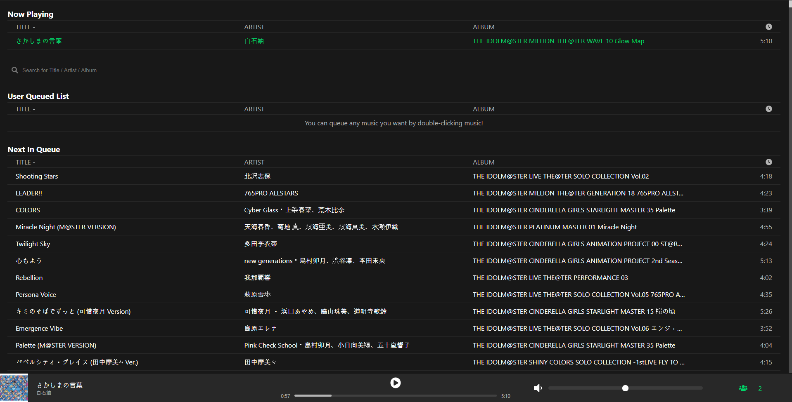

<!-- PROJECT LOGO -->
<br />
<p align="center">
  <a href="https://github.com/hw4n/ody">
    
  </a>

  <h3 align="center">Ody</h3>

  <p align="center">
    Frontend of Project Melody,
    <br />
    Radio-ish music streaming on a web
  </p>
</p>

<!-- TABLE OF CONTENTS -->
<details open="open">
  <summary>Table of Contents</summary>
  <ol>
    <li>
      <a href="#about-the-project">About The Project</a>
      <ul>
        <li><a href="#built-with">Built With</a></li>
      </ul>
    </li>
    <li>
      <a href="#getting-started">Getting Started</a>
      <ul>
        <li><a href="#installation">Installation</a></li>
      </ul>
    </li>
    <li><a href="#contributing">Contributing</a></li>
    <li><a href="#license">License</a></li>
    <li><a href="#contact">Contact</a></li>
    <li><a href="#acknowledgements">Acknowledgements</a></li>
  </ol>
</details>

<!-- ABOUT THE PROJECT -->
## About The Project

<p align="center">
  
</p>

Spotify is cool and I love it, but how do you enjoy any mp3 file you have with your friends?

This project's main objective is to be able to enjoy mp3 file with others, in the same time.

### Built With

* [ReactJS](https://reactjs.org)
* [Socket.io](https://socket.io)

<!-- GETTING STARTED -->
## Getting Started

This project uses `socket.io` to transport music data such as title, artist, and album.

This means [Mel](https://github.com/hw4n/mel), a backend server must be running before setting this project up.

### Installation

1. Clone the repo
   ```sh
   git clone https://github.com/hw4n/ody
   ```
2. Install dependencies
   ```sh
   yarn install
   ```
3. Starting local server
   ```sh
   yarn start
   ```
   And additionally if you want to distribute,
4. Building react app
   ```sh
   yarn build
   ```
   then move `build` directory to [Mel](https://github.com/hw4n/mel)'s directory

<!-- CONTRIBUTING -->
## Contributing

Any contributions you make are **hugely appreciated**.

<!-- LICENSE -->
## License

Distributed under the MIT License. See `LICENSE` for more information.

<!-- CONTACT -->
## Contact

Hwanhee Chae - hh@hwan.me

Project Link: [https://github.com/hw4n/ody](https://github.com/hw4n/ody)

<!-- ACKNOWLEDGEMENTS -->
## Acknowledgements
* [Font Awesome](https://fontawesome.com)
* [Best README Template](https://github.com/othneildrew/Best-README-Template)
