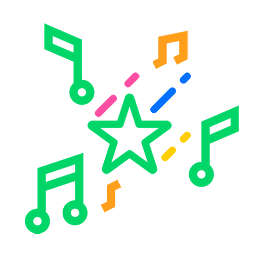

<!-- PROJECT LOGO -->
<br />
<p align="center">
  <a href="https://github.com/hw4n/ody">
    
  </a>

  <h3 align="center">Mel</h3>

  <p align="center">
    Backend of Project Melody,
    <br />
    Radio-ish music streaming on a web
  </p>
</p>

<!-- TABLE OF CONTENTS -->
<details open="open">
  <summary>Table of Contents</summary>
  <ol>
    <li>
      <a href="#about-the-project">About The Project</a>
      <ul>
        <li><a href="#built-with">Built With</a></li>
        <li><a href="#key-features">Key Features</a></li>
      </ul>
    </li>
    <li>
      <a href="#getting-started">Getting Started</a>
      <ul>
        <li><a href="#installation">Installation</a></li>
      </ul>
    </li>
    <li><a href="#contributing">Contributing</a></li>
    <li><a href="#license">License</a></li>
    <li><a href="#contact">Contact</a></li>
    <li><a href="#acknowledgements">Acknowledgements</a></li>
  </ol>
</details>

<!-- ABOUT THE PROJECT -->
## About The Project

Spotify is cool and I love it, but how do you enjoy any mp3 file you have with your friends?

This project's main objective is to be able to enjoy mp3 file with others, in the same time.

### Built With

* [Node.js](https://nodejs.org)
* [Socket.io](https://socket.io)

### Key Features

Simply put, it's an endless radio station made of your mp3 files.

Please check another repository [ody](https://github.com/hw4n/ody) for frontend features!

* Radio station
  * Just keeps going even if noone's listening.
* Enqueuing music by request
* Synchronized music position
* Extracting cover image and metadata from mp3 file
  * Romaji converting music title and artist for Japanese
* Saving and comparing metadata on a mongoDB database
* Get/Update lyrics from the database
* Console commands
  * Force skipping music
  * Reloading music without restarting the server

...and small features that I did not write

<!-- GETTING STARTED -->
## Getting Started

This project provides only a backend server.

[Ody](https://github.com/hw4n/ody), a frontend is needed before distributing.

### Installation

1. Clone the repo
   ```sh
   git clone https://github.com/hw4n/mel
   cd mel
   ```
2. Install dependencies
   ```sh
   yarn install
   ```
3. Set environment variables  
   Create ``.env``  
   Use any of your choice
   ```sh
   vim .env
   code .env
   ...more
   ```
   Don't change port if it's not needed, [Ody](https://github.com/hw4n/ody) uses proxy to port 3333 for default
   Also set DBURI to your own mongoDB connection string
   ```
   PORT=3333
   DBURI=mongodb+srv://...
   ```
4. Create ``mp3`` and ``cover`` directory  
   ``mp3`` : Put any mp3 you want on the web, also it finds any mp3 file recursively, just put any mp3 files you have
   ``cover`` : Here is the directory where the cover image is temporarily stored
   ```
   mkdir mp3 cover
   ```
   I will assume that you already have put any mp3 files inside ``mp3``
4. Compile and run
   ```sh
   tsc && node built/index.js
   ```
5. And distributing  
   So you built [Ody](https://github.com/hw4n/ody) project and have `build` directory and current directory look like this:  
   ```
   build <-- important!!
   built
   cover
   mp3
   node_modules
   src
   and others...
   ```
   Add ``STAGE=live`` to ``.env`` so that look like below  
   Also after this point it is fine to change port
   ```
   PORT=3333
   STAGE=live
   ```

<!-- CONTRIBUTING -->
## Contributing

Any contributions you make are **hugely appreciated**.

<!-- LICENSE -->
## License

Distributed under the MIT License. See `LICENSE` for more information.

<!-- CONTACT -->
## Contact

Hwanhee Chae - hh@hwan.me

Project Link: [https://github.com/hw4n/mel](https://github.com/hw4n/mel)

<!-- ACKNOWLEDGEMENTS -->
## Acknowledgements
* [Best README Template](https://github.com/othneildrew/Best-README-Template)
